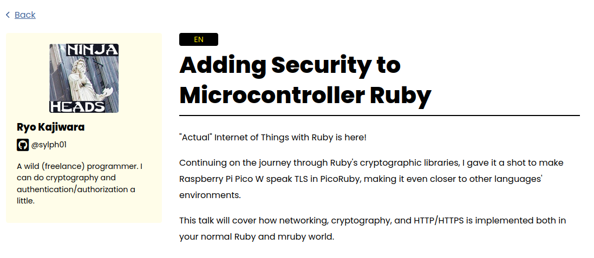
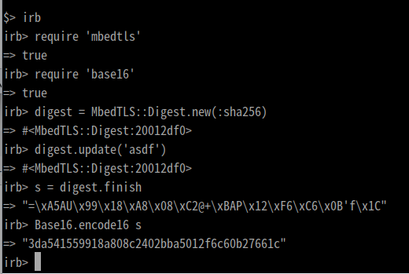
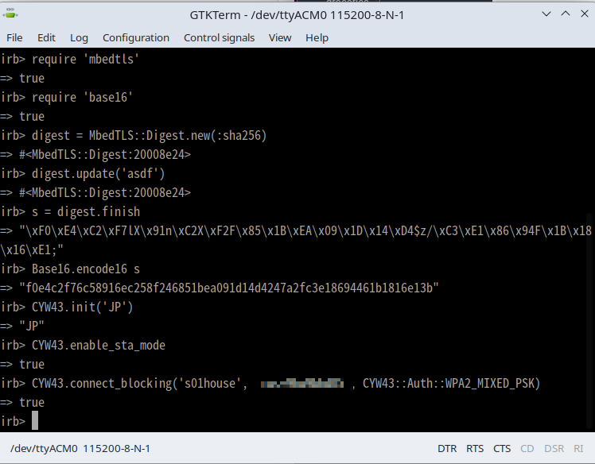

<!-- _class: titlepage -->

# Updates on PicoRuby Networking, HPKE (and maybe more)
## Ryo Kajiwara/梶原 龍 (sylph01)
### 2024/8/31 @ RubyKaigi 2024 Followup

----

# だれ / なに



<!--
やせいのプログラマ。暗号とか認証認可とかできます。
RubyKaigiではPicoRubyのWiFiの実装の話をしました。
今日の話はだいたいその両方の話をします。
-->

----

# おまけ: RubyKaigi 2025の話

- Local Organizerをしています（あってるはず）
- 近況
  - 7/11に道後温泉本館の改修工事が終了、全館営業開始
  - 9/29にJR松山駅がリニューアルオープン
- お酒とジュースを持ってきています
- [ふるさと納税よろしくねよろしくね](https://d.s01.ninja/entry/20211206/1638748800)

<!-- まあこれに来てる人はRubyKaigiの宣伝しなくても来るとは思いますが… -->

----

----

# Part 1:
# PicoRubyのWiFi機能

----

# PicoRubyのWiFi機能

- いい加減pull requestを出しました
  - [picoruby/picoruby#174](https://github.com/picoruby/picoruby/pull/174)
  - [picoruby/R2P2#12](https://github.com/picoruby/R2P2/pull/12)
- 割と巨大なpull requestですが実質的にはほぼRubyKaigiの発表通り

----

# R2P2のビルドオプションの追加

- 今まで: `BOARD=pico_w rake`
- 今回の変更後: Pico Wについては必要な機能を選んでビルドする
  - `WIFI=yes BOARD=pico_w rake`
  - `BLE=yes BOARD=pico_w rake`
  - `WIFI=yes BLE=yes BOARD=pico_w rake`
  - `BOARD=pico_w` なら `WIFI` / `BLE` 両方オフはエラー
- これによってWiFiを使わない場合はちゃんとRAMが194KB使える

----

# 今後このへんやる人向けメモ

- Cコンパイラのプリプロセッサオプションを渡す: 以下の両方をする
  - `build_config` ファイル内の `conf.cc.defines` に追加
  - CMakeLists.txt の中で `add_definitions`

<!-- mruby系のビルド周りけっこうundocumentedな気がする、もうちょっとわかったらまとめたい -->

----

# WiFiを使わなくてもBLEがcyw43-archを必要とする

```cmake
  if(DEFINED ENV{PICO_W_WIFI})
    # these are used only in WiFi build
    target_link_libraries(${PROJECT_NAME} PRIVATE
      pico_cyw43_arch_lwip_threadsafe_background
      (...)
    )
    (...)
  else()
    # Even the BLE build needs a pico_cyw43_arch, only in a different flavor
    target_link_libraries(${PROJECT_NAME} PRIVATE
      pico_cyw43_arch_none
    )
  endif()
```

<!-- WiFiとBLEのチップが同じなのでそのライブラリは入れてあげなきゃいけない。BLEだけならlwIPは要らないので pico_cyw43_arch_none -->

----

# WiFi向けビルドでなぜかSHA256がSHA-1になる問題

## ヒント: SHA-1の出力は160bit(20byte)



----

# Mbed TLSのバージョンの話

- Pico SDKに入っているバージョンは2.28.1相当
  - 実はpico-sdk 1.5.1の指しているsubmoduleのコミットはもっと中途半端な位置
- `picoruby-mbedtls` mrbgemが指していたバージョンは3.4.1

----

# Mbed TLS 2系での定義

```c
typedef enum {
    MBEDTLS_MD_NONE=0,    /**< None. */
    MBEDTLS_MD_MD2,       /**< The MD2 message digest. */
    MBEDTLS_MD_MD4,       /**< The MD4 message digest. */
    MBEDTLS_MD_MD5,       /**< The MD5 message digest. */
    MBEDTLS_MD_SHA1,      /**< The SHA-1 message digest. */
    MBEDTLS_MD_SHA224,    /**< The SHA-224 message digest. */
    MBEDTLS_MD_SHA256,    /**< The SHA-256 message digest. */
    MBEDTLS_MD_SHA384,    /**< The SHA-384 message digest. */
    MBEDTLS_MD_SHA512,    /**< The SHA-512 message digest. */
    MBEDTLS_MD_RIPEMD160, /**< The RIPEMD-160 message digest. */
} mbedtls_md_type_t;
```

<!--
  SHA-1ですら避けたくて、MD5ですら現代で使うべきでない。
  MD2? MD4? もっと使うべきでない。
-->

----

# Mbed TLS 3系での定義

```c
typedef enum {
    MBEDTLS_MD_NONE=0,    /**< None. */
    MBEDTLS_MD_MD5,       /**< The MD5 message digest. */
    MBEDTLS_MD_SHA1,      /**< The SHA-1 message digest. */
    MBEDTLS_MD_SHA224,    /**< The SHA-224 message digest. */
    MBEDTLS_MD_SHA256,    /**< The SHA-256 message digest. */
    MBEDTLS_MD_SHA384,    /**< The SHA-384 message digest. */
    MBEDTLS_MD_SHA512,    /**< The SHA-512 message digest. */
    MBEDTLS_MD_RIPEMD160, /**< The RIPEMD-160 message digest. */
} mbedtls_md_type_t;
```

----

# 0x04 = 
# (Mbed TLS 2では) **SHA1**
# (Mbed TLS 3では) **SHA256**

----

# Mbed TLS 3系でコンパイルされて
# Mbed TLS 2系を利用したらこうなる

----

# 直した

- mrbgem側のMbed TLSのバージョンを2系にrevert
- Mbed TLS 3系依存のコードを微修正
- ビルドキャッシュに悩まされた



----

# そのうちgenerally availableになるのでみんな使ってください

----

# Raspberry Pi Pico 2ですってよ

- 石がRP2350という新しいのになっている
  - Arm Cortex-M33
  - Arm TrustZone搭載
    - **$5で買えるTEE(Trusted Execution Environment)**
  - RISC-Vにも切り替え可能（！？）
- SRAMが倍(520KB)になった

security featureが増えたということで **本当の意味でAdding Security** できてしまう…のか…？

<!-- メモリ増えたのでPico 2 W出たらサーバー機能考えてもよくなるかもしれない -->

----

----

# Part 2:
# Hybrid Public Key Encryption

----

# HPKE is 何

私が解説するまでもなく[『HPKEとは何か | blog.jxck.io』](https://blog.jxck.io/entries/2022-08-25/hpke.html) が日本語における決定版。

雑にいうなら、

- 公開鍵暗号で鍵を交換して
- 共通鍵暗号で通信本体を行う
- っていうやつを汎用化したもの

----

# どこまでやった

今のところ

- [ruby/opensslに依存するgem](https://github.com/sylph01/hpke-rb)
- [ruby/opensslのフォーク](https://github.com/sylph01/openssl/tree/hpke)

の2つのフレーバーがある。（これは去年の12月時点でそう）

----

# 今後どうする

- ruby/openssl、というかOpenSSLのHPKE機能のAPIが割としっかり決まっているのでgem側のAPIをそっちに寄せてgem側を1.0とする
- ruby/opensslにpull requestする
  - 止まってるのが「OpenSSLにHPKEがないバージョンで無効化する/テストも除外する」という部分
- 特にタイムリミット決めてはないけど年内あたりに入るといいなあ

----


----

# Part 3:
# 始めてすらいない話

----

# **ブラウザRuby**アツいけど
# **暗号**できんの？

----

# 大統一暗号API？

- 「普段のRuby」はだいたいOpenSSL使ってる
- PicoRubyほか組み込み向けRubyの場合はMbed TLS
- ブラウザはWebCrypto API経由で使う
- これらのAPI wrapperを作ると全環境向けのgemが書けるのでは？
- まだ考えてるだけなのでフィードバックほしい