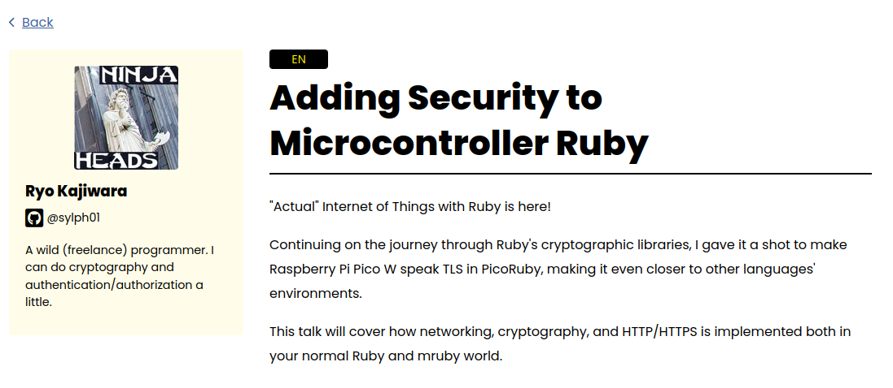

<!-- _class: titlepage -->

# "**A**ctual" **S**ecurity in **M**icrocontroller **R**uby!?
## Ryo Kajiwara/梶原 龍 (sylph01)
### 2024/12/07 @ KeebWorld Conference 2024

---

# だれ / なに



<!--
  やせいのプログラマをしていて、認証認可とか暗号とかができます。
  今年のRubyKaigiではRaspberry Pi Pico Wのネットワーク機能をPicoRubyから使えるようにするという話をしました。今日の話も似たような話です。タイトルも似てるし。
-->

---


<!--
  キーボード的な話をするならば、日常使いのキーボードはKeebioのIrisで、過去に合計7枚組んで4枚が現役、まだ組んでいないPCBが2枚あります。
  この子はポップンミュージックの蒼井硝子（あおい-しょうこ）ちゃんというキャラクターをモチーフにしたキーキャップであるGMK Shokoと、その色に合う軽量リニアスイッチであるYushakobo Fairy Silent Linear Switchを使っています。軽量リニアスイッチ、いいですよね
-->

---


<!--
  Phyrexia: Keeb Will Be One
-->

---

# RubyKaigi followupでこんなこと言ってましたね？


---

# 今日の話

- RP2350のセキュアブートで遊んでみた
- キーボードへのインパクトは？
- PicoRubyへのインパクトは？

---

# 注意

- いつもの「暗号には気をつけよう」に加えて
- **チップに対して不可逆な操作を行います**
  - One-Time Programmable Memory (OTP)への書き込みは名前の通り不可逆です
  - セキュアブートはこの領域に鍵のフィンガープリントを書き込むことで行います
  - 鍵のバックアップをし損ねると**そのRP2350は文鎮です**

---

# RP2350

Raspberry Pi Pico 2世代の石。

- ARM Cortex-M33
  - Dual-core, 150MHz
  - 520KB on-chip SRAM
    - up from 260KB!
  - **ARM TrustZone搭載**
    - 「$5で買えるTEE」
  - 8KBのOTPを持つ


<!--
  今手頃に手に入るRP2350っていうとRaspberry Pi Pico 2とSparkFun Pro Micro RP2350。後者はUSB Type-CだしPro Microフォームファクタなのでキーボード組み込みには都合いいけど高い。コンスルーの高さ間違えて数千円捨てるところだった
-->

---

# セキュアブート

- Boot Signing
  - 秘密鍵を使って署名したファームウェアを書き込み、OTPに書き込んだ公開鍵を使って署名を検証
  - 通常セキュアブートといえばこっち
  - RP2350においては**RISC-Vコアを完全に無効化する**
- Encrypted Boot
  - 暗号化したバイナリを書き込み、OTPに書き込んだ鍵を使って復号、プログラムを実行する
    - AESを使っているので**共通鍵暗号**

---

---

# 実際にやってみる

Raspberry Pi Foundationが主催している "RP2350 Hacking Challenge" (https://github.com/raspberrypi/rp2350_hacking_challenge) というレポジトリにOTPへの書き込みとBoot Signingのサンプルがあるのでそれを試してみる。

---

# OTPへの書き込み

```
~/projects/rp2350_hacking_challenge$ ./write_otp_secret.sh
picotool otp set -e 0xc08 0xc0ff
ROW 0x0c08  OLD_VALUE=0x000000
picotool otp set -e 0xc09 0xffee
ROW 0x0c09  OLD_VALUE=0x000000
...
```

---

# もう1回やると

```
~/projects/rp2350_hacking_challenge$ ./write_otp_secret.sh
picotool otp set -e 0xc08 0xc0ff
ROW 0x0c08  OLD_VALUE=0x22c0ff
ERROR: Cannot modify OTP ECC row(s)
```

---

# OTPからの読み出し

```
~/projects/rp2350_hacking_challenge$ ./read_otp_secret.sh
    VALUE 0x22c0ff
    VALUE 0x14ffee
...
```

---

# 何をしている

```
picotool otp set -e 0xc08 0xc0ff
```

アドレス `0x0c08` に`0xc0ff` という値を書き込む。

```
picotool otp get -e 0xc08 | grep VALUE
```

アドレス `0x0c08` から値を読み出し、出力のうち `VALUE` と書かれた行を取り出す。これは `otp get` が一部のアドレスに対して説明を付与することがあるため。

---

# 何をしている

`0xc0ff` を書いたのに `VALUE 0x22c0ff` が出てくるのはなんで？

→OTPはECCで保護されている領域で、以下のように構成される:

- `23:22` がBit Repair by Polarity (BRP) フラグ
- `21:16` がModified Hamming ECC
- `15:0` がデータ本体

OTPをデータの物理的な破壊によって変更するのはかなり困難。

<!--
  _footer: https://datasheets.raspberrypi.com/rp2350/rp2350-datasheet.pdf 13.6. Error Correction Code (ECC) 
-->

---

# `enable_secureboot.sh`

やっていることは `picotool otp load otp.json` で、`otp.json` には

- `boot_flags1`: `{"key_valid":1}`
- `bootkey0`: 公開鍵のフィンガープリント
- `crit1`: `{"secure_boot_enable":1}`

が含まれる。これは `CMakeLists.txt` 中の

```
pico_set_otp_key_output_file(target_name /path/to/otp.json)
```

で作るよう指示される。

<!--
  _footer: https://datasheets.raspberrypi.com/rp2350/rp2350-datasheet.pdf 5.10.1. Secure Boot
-->

---

# `CMakeLists.txt` で指定する内容

- `pico_set_binary_type`: `no_flash` でSRAMから実行
- `pico_sign_binary`: 指定した鍵ファイルで署名することを指示
- `pico_hash_binary`: バイナリのハッシュを取ることを指示
- `pico_package_uf2_output`: SRAM上で実行されるパッケージ化バイナリを作る
- `pico_set_otp_key_output_file`: `otp.json` の位置を設定
- `pico_add_extra_outputs`: これを呼ぶことで `sign` と `hash` が実行される

---

# 実際はどうやって実行されてる？

<!--
  _footer: https://github.com/raspberrypi/pico-sdk/blob/efe2103f9b28458a1615ff096054479743ade236/tools/CMakeLists.txt#L424
-->

`CMakeLists.txt` で上記のフラグを有効にしていると、 `pico-sdk/tools/CMakeLists.txt` 内 `picotool_postprocess_binary` にて `picotool seal` を呼ぶことでバイナリの署名をとっている。

Encrypted Bootの際の暗号化も同 `picotool_postprocess_binary` 内。

---

# `lock_chip.sh`

もっと強力にチップを保護する。以下のフラグを書き込む:

- デバッグの無効化
- 他のブートキーを無効化
- Glitch Detectorを有効化し最も強い感度で利用
  - fault injectionからの保護を行う

---

# バイナリを書いてみた

普通にUSBマスストレージに署名された `.uf2` を落とすだけ。

- 違う鍵で署名された `.uf2` を落とすと再起動すらしなかった
- `secure_version` はUSBすら無効化されているので `/dev/ttyACM0` すら出てこない


---

# データシートを読んでみる

---

---

# キーボードにとって何が嬉しいの？

ファームウェアの悪意のある書き換えから身を守ることができる、ということは:

- 不在の間にキーマップを勝手に書き換えられることから身を守ることができる
- ネットワークにつながる板だった場合に**キーストロークの悪意のあるモニタリングと送信から身を守ることができる**
  - キーボードがネットワークにつながる？→PicoRubyはWiFi対応したのでできてしまうんですね…

---

# ぶっちゃけプログラマブルな自作キーボードって高いコンプライアンス要件にとっては悪夢では

外部から制限付きとはいえ計算機を持ち込んでいるに等しい。WiFiに繋がるキーボードなんてもってのほか。

ファームウェアが信用できない場合は信用できない計算機を持ち込んでいることになる。**動かしているファームウェアに確証が持てる**ことはその点で嬉しい（本当に？）。

---

# OTPの存在がかなり嬉しい

- デバイスに恒久的な初期設定値を焼くことができる
  - 身近なところだとデバイスの識別子とか
- セキュアモードからしか読めないOTP領域を設定できるので
  - 鍵を安全に保管することができる

---

# PicoRubyで使える？

- Boot Signing/Encrypted Boot自体はビルド手順にちょっと手を加えることでできそう
- もっともセキュアブートによる保護を得られるのは `.uf2` の部分だけ
  - PRK Firmwareの `keymap.rb` も抱き込んでしまえば保護が得られるが現在はそうなっていない
  - 抱き込んじゃうとPRK Firmwareの最大の利点であるレイアウト変更の容易性が失われる…

---

# PicoRubyで使える？

- RP2350固有の機能をPicoRubyから使うにはPicoRuby側に手を入れる必要がある
  - OTPの値を読む
  - RP2350には乱数生成器(TRNG)がついているのでそれもほしい
  - SHA256のアクセラレータも使える？
