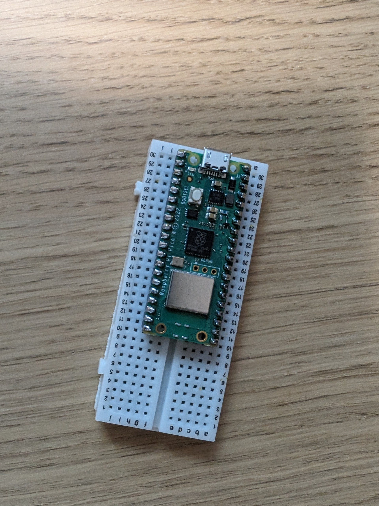
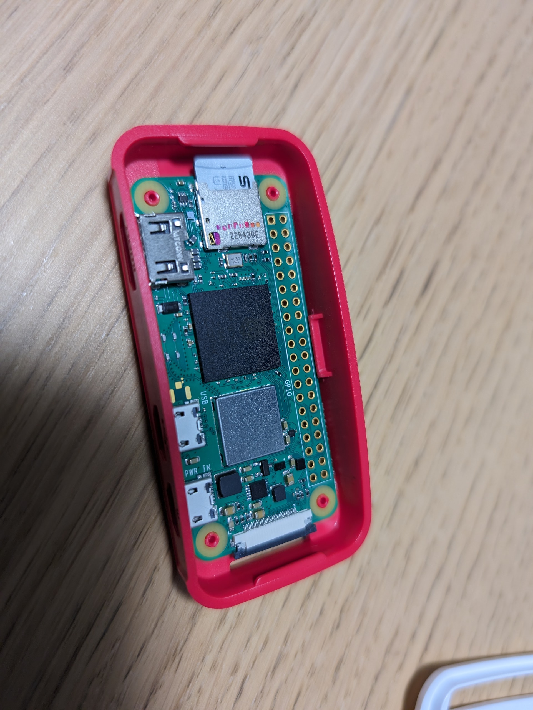
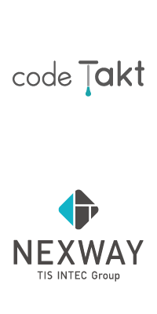

<!-- _class: titlepage -->

# **A**dding **S**ecurity to **M**icrocontroller **R**uby
## Ryo Kajiwara/梶原 龍 (sylph01)
### 2024/5/16 @ RubyKaigi 2024

---

# Slides are available at:

## https://speakerdeck.com/sylph01/adding-security-to-microcontroller-ruby


---

<!-- _class: titlepage -->

# Hi!

---

<!--
  _class: titlepage_white
-->

# I do stuff

- Play rhythm games (especially DanceDanceRevolution)
  - btw, I'm DJing rhythm game songs at RubyMusicMixin this year so come see me there too!
- Play the bassoon/contrabassoon
- Ride a lot of trains (Rails!) (travelled on 99% of JR)
- Build keyboards

if anything catches your interest let's talk!


---

<!-- _class: titlepage -->

# And I do stuff

that is more relevant to this talk:

- Freelance web developer focused on Digital Identity and Security
- Worked/ing on writing/editing and implementing standards
  - HTTPS in Local Network CG / Web of Things WG @ W3C, OAuth / Messaging Layer Security WG @ IETF
- Worked as an Officer of Internet Society Japan Chapter (2020-23)

----

----

# Previously in "Adventures in the Dungeons of OpenSSL" ...

(talk at RubyConf Taiwan 2023)

- Implemented HPKE (RFC 9180)
  - Using OpenSSL gem (GH: sylph01/hpke-rb)
  - Also by extending OpenSSL gem

----

# Why not implement cryptography into **microcontrollers**?
# Maybe we can get **TLS** too?

----

# Raspberry Pi Pico W

- Board with RP2040 microcontroller
  - Dual-core ARM Cortex-M0+ @ 133MHz
  - **264kB SRAM**, 2MB Flash
- Wireless LAN (802.11n) with CYW43439
- 1353 yen (as of 4/18/2024)
  - 技適 certified!



<!--
  https://www.switch-science.com/products/8171

  it's 技適 certified so we can legally use wireless functionality in Japan!

  btw the size of SRAM becomes important later
-->

----

# Target environment

- (all of the following is done by @hasumikin -san)
- PicoRuby + R2P2
  - https://github.com/picoruby/picoruby : Ruby implementation
  - https://github.com/picoruby/R2P2 : Shell system for Pi Pico (W)
- Well-known usage: "PRK Firmware: Keyboard is Essentially Ruby" (RubyKaigi 2021 Takeout) https://www.youtube.com/watch?v=5unMW_BAd4A

----

# MicroPython has this already

```python
import network
from time import sleep

wlan = network.WLAN(network.STA_IF)
wlan.active(True)
wlan.connect('ssid', 'password')

while wlan.isconnected() == False:
  print('Connecting...')
  sleep(1)
print(wlan.ifconfig())
```

<!-- _footer: code from https://projects.raspberrypi.org/en/projects/get-started-pico-w/2 -->

----

# Project
# **A**dding
# **S**ecurity to
# **M**icrocontroller
# **R**uby

<!--
  _class: stacking-headers
-->

<!--
  I came up with this name while writing the CfP
-->

----

# More like
# Adding
# **SSL/TLS** to
# Microcontroller
# Ruby

<!--
  _class: stacking-headers
-->

----

# or
# Adding
# **Networking** to
# Microcontroller
# Ruby

<!--
  _class: stacking-headers
-->

<!--
  but meme value, right?
-->

----

# [Demonstration](https://youtu.be/oYiBG7P2yyE)

If you want to see it in person, come find me any time during the Kaigi!

----

# Caution: Here be dragons

- Cryptographic API is prone to misuse
- Most implementation here are experimental
  - Gems that entered PicoRuby/R2P2 are pretty much "prod-ready"
  - Everything else (esp. stuff that touches networking hardware) should be considered experimental

<!--
  here's the obligatory warning
-->

----

# Caution: Embedded bugs are hard

I'm treating Pico W as "a normal computer" whenever I can.

**This is not trivial at all.** There could be many random stuff I am missing.

This is possible thanks to:

- Pico SDK (including lwIP, Mbed TLS)
- R2P2 (shell system)

----

----

<!-- _class: titlepage -->

# Part 1:
# Cryptography in PicoRuby

----

# Quick Recap: SHA256 in Ruby

```ruby
require 'openssl'

digest = OpenSSL::Digest.new('sha256')
digest.update('The magic words are ')
digest.update('squeamish ossifrage.')

OpenSSL::Digest::SHA256.hexdigest(
  'The magic words are squeamish ossifrage.'
)
```

----

# Quick Recap: AES in Ruby (encryption)

```ruby
require 'openssl'

cipher = OpenSSL::Cipher::AES128.new('CBC')
cipher.encrypt
key = cipher.random_key
iv  = cipher.random_iv

enc =  cipher.update('The magic words are ')
enc += cipher.update('squeamish ossifrage.')
enc += cipher.final
```

----

# Quick Recap: AES in Ruby (decryption)

```ruby
# cont'd
decipher = OpenSSL::Cipher::AES128.new('CBC')
decipher.decrypt
decipher.key = key
decipher.iv  = iv

plain =  decipher.update(enc)
plain += decipher.final
```

----

# OpenSSL is too big, what do we do?

- There are cryptographic libraries for embedded systems
  - Mbed TLS, wolfSSL
- Pico SDK uses **Mbed TLS**
- Mbed TLS has build options to only include needed functionality
  - See `R2P2/include/mbedtls_config.h`

----

# PicoRuby didn't have Base16/64

- Because Base16/64 is for humans, not for devices!
- What's Base16? It's `Array#pack` with `H*`
- I added this first so that debugging cryptography is easier

----

# AES in PicoRuby + Mbed TLS

```ruby
require 'mbedtls'
require 'base64'
key = Base64.decode64 "aGB7hvLWxE60PsxbPS9wsA=="
iv  = Base64.decode64 "J4b4xJuIHry/aUpVeyRIJw=="
cipher = MbedTLS::Cipher.new(:aes_128_cbc, key, :encrypt)
cipher.set_iv(iv)
s = cipher.update('asdfasdfasdfasdfasdf')
s << cipher.finish
Base64.encode64 s
```

----

# SHA256 in PicoRuby + Mbed TLS

```ruby
require 'mbedtls'
require 'base16'
digest = MbedTLS::Digest.new(:sha256)
digest.update('asdf')
s = digest.finish
Base16.encode16 s
```

----

# Mbed TLS in PicoRuby

- PicoRuby already had CMAC using Mbed TLS
- I added the most commonly used algorithms:
  - AES-(128/192/256)
    - non-AEAD: CBC mode
    - AEAD: GCM mode
  - SHA-256

----

# Implementation Details
## or Introduction to mruby/c Extensions

----

# mruby/c vs CRuby

- We can wrap C values inside a Ruby object
  - CRuby: `RTYPEDDATA_DATA(obj)`
  - mruby/c: create an instance with
    `mrbc_instance_new(vm, v->cls, sizeof(C_VAL_TO_WRAP))`
  - Here, we want to wrap the "context" struct created by OpenSSL or mbed TLS

----

# mruby/c vs CRuby

- Defining methods
  - CRuby: `rb_define_method`
    - Takes a class, name, function pointer, and number of args
    - Get arguments from the function's arguments
  - mruby/c: `mrbc_define_method`
    - Takes a pointer to VM, class, name, function pointer
    - Get arguments using `GET_ARG(POSITION)`

----

```c
static void
c_mbedtls_digest__init_ctx(mrbc_vm *vm, mrbc_value *v, int argc)
{
  /* (snip) argument check */
  mrbc_value algorithm = GET_ARG(1);
  mrbc_value self = mrbc_instance_new(vm, v->cls, sizeof(mbedtls_md_context_t));
  mbedtls_md_context_t *ctx = (mbedtls_md_context_t *)self.instance->data;
  mbedtls_md_init(ctx);

  const mbedtls_md_info_t *md_info = mbedtls_md_info_from_type(
    c_mbedtls_digest_algorithm_name(mrbc_integer(algorithm))
  );
  int ret;
  ret = mbedtls_md_setup(ctx, md_info, 0);
  // error check
  ret = mbedtls_md_starts(ctx);
  // error check

  SET_RETURN(self);
}
```

----

```c
static void
c_mbedtls_digest_update(mrbc_vm *vm, mrbc_value *v, int argc)
{
  /* (snip) argument check */
  mrbc_value input = GET_ARG(1);

  int ret;
  mbedtls_md_context_t *ctx = (mbedtls_md_context_t *)v->instance->data;
  ret = mbedtls_md_update(ctx, input.string->data, input.string->size);
  // error check

  mrbc_incref(&v[0]);
  SET_RETURN(*v);
}
```

<!--
We first take the wrapped context from the instance, then pass it to Mbed TLS's functions.

When you define an instance method, you want to call `mrbc_incref` to prevent the object from being GCed.
-->

----

# One-shot API?

In a memory-constrained environment, it's better to have multiple-call APIs instead of one-shot APIs, because to use the one-shot API, you need twice the memory of the original string.

<!--
With multiple-call APIs, we can process partially encrypted strings (send them) then free that buffer to continue with the rest.

You can of course write wrappers though.
-->

----

# Did I say "don't use fixed nonces"

- It reduces security significantly
  - cf. PlayStation 3's code signing key leak (ECDSA)
- We need a **Random Number Generator**
  - But do we have `/dev/random` ... No!
  - We use the **Ring Oscillator (ROSC)** to extract random bits
  - You can use this through the `RNG` gem

----


<!--
https://datasheets.raspberrypi.com/rp2040/rp2040-datasheet.pdf

2.17.5. Random Number Generator

This does not meet the requirements of randomness for security systems because it can be compromised,
but it may be useful in less critical applications. If the cores are running from the ROSC then the value will not be
random because the timing of the register read will be correlated to the phase of the ROSC.
-->

----

```c
uint8_t c_rng_random_byte_impl(void)
{
  uint32_t random = 0;
  uint32_t bit = 0;
  for (int i = 0; i < 8; i++) {
    while (true) {
      bit = rosc_hw->randombit;
      sleep_us(5);
      if (bit != rosc_hw->randombit)
        break;
    }
    random = (random << 1) | bit;
    sleep_us(5);
  }
  return (uint8_t) random;
}
```

<!--
We use a technique called "von Neumann whitening",
where we turn the ups and downs of the sequence into 1s and 0s,
instead of using the 0s and 1s directly from the output.
This decreases the bias of the output. 
-->

----

----

<!-- _class: titlepage -->

# Part 2:

# Networking

----

(overview)

- General overview of what was missing
- What do we mean by Networking here
  - WiFi, TCP/IP
- Debugging Networking
  - Use RasPi 5 as a WiFi router
  - Wireshark
- misc
  - mruby/c's String's actual C representation is guaranteed to be null-terminated https://github.com/mrubyc/mrubyc/blob/master/src/c_string.c#L71-L103

----

- Connect to WiFi AP with CYW43
- Introduction to lwIP
- DNS
  - actually this was easy
- TCP Client
  - Application Layered TCP
- If you have TCP Client then Basic HTTP is easy

----

- TLS
  - with lwIP and ALTCP TLS is pretty trivial
  - Implementation quirks
    - you cannot call `malloc()` and `free()`
      - They are libc functions. If you do it hangs up
      - `mrbc_raw_alloc`, also lwIP has its own memory management
    - OOM
      - to enable TLS I had to reduce R2P2's heap memory significantly

----

----

<!-- _class: titlepage -->

# Part 3:

# Fleshing Out Networking

----

(overview)

- Look & Feel of the API
- Blocking vs Non-Blocking
- Porting of MicroPython's Networking
  - details
  - Sockets?

----

----

<!-- _class: titlepage -->

# Conclusion

----

<!-- _class: titlepage_white -->

# We **can haz** TLS in PicoRuby!


----

# Stuff delivered

- In PicoRuby/R2P2 now!
  - Base16, Base64
  - SHA256
  - AES Encryption (CBC, GCM)
  - Random Number Generator

----

# Stuff delivered (cont)

- Experimental
  - CYW43
    - Connect to WiFi
  - Net
    - DNS
    - TCPClient
    - HTTP(S)Client
      - GET

----

# But do we **really** need TLS?

- Symmetric crypto is okay, but asymmetric crypto is **very slow**
- Performance numbers from similar environments:
  - [STM32L562E Cortex-M33 at 110 MHz, wolfSSL](https://www.wolfssl.com/docs/stm32/)
    - RSA 2048 Signing: 9.208 ops/sec
    - RSA 2048 Verfiication: **0.155 ops/sec**
    - ECDHE 256 Key agreement: **0.661 ops/sec**

----

# But do we **really** need TLS?

Also, without a trust store, we will get **encryption** through TLS, but we will not get the **authentication** part of TLS.

For these reasons, depending on your security needs, it would be enough to **just use symmetric crypto** between the gateway and use TLS from there.

<!--
  In this case, the gateway has a trust store (trusted certificate list) and thus will be capable of authentication.

  Note: In this case you have to provision your devices with a fixed symmetric key. Physical compromise of the device is possible. But do you even care about that in most cases?
-->

----

## You might want to use a **Raspberry Pi Zero 2 W** if you want a "more traditional" computer experience

Runs a Linux, can SSH into it, can run a GUI, has enough power to run asymmetric crypto



----

# Why use a Pico?

**It's closer to hardware.** It's easier to embed into other hardware.


----

<!--
  _class: titlepage_white
-->

# In an IoT environment,

# these devices **work in concert**


----

<!--
  _class: titlepage_white
-->

# With Pico's WiFi connectivity,

# we can say **Actual IoT with Ruby** is closer to a reality!


----

# Possible Future Work in IoT area

- CBOR/COSE/CoAP support
  - Think of it as "JSON in binary"
- There are working groups in the IETF geared towards "constrained environments"
  - Authentication and Authorization for Constrained Environments
  - Lightweight Authenticated Key Exchange
  - Software Updates for Internet of Things

----

<!--
  _class: titlepage_white center
-->

# It's a **Blue Ocean**


<!--
  The community is waiting for your contribution!
-->

----

# Shoutouts

(@ mentions are in GitHub ID)

- Major shoutouts to @hasumikin for the extensive work in PicoRuby and helping me develop stuff on it
- Past RubyKaigi speakers, esp. @unasuke and @shioimm (Team Protocol Implementers!)

And to the organizers of RubyKaigi 2024!

---

# More Shoutouts

Sponsors of RubyKaigi, esp:

- codeTakt Inc.
  - I am currently developing an ID platform for public schools with them
- Nexway Co., Ltd.
  - I have played multiple times in TIS INTEC Group's orchestra




----

# Questions? / Comments?

## Twitter: @s01 or Fediverse: @s01@ruby.social
