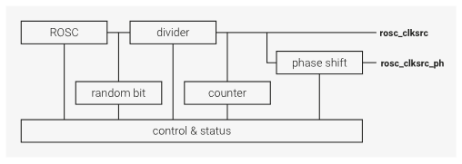

<!-- _class: titlepage -->

# **A**dding **S**ecurity to **M**icrocontroller **R**uby
## Ryo Kajiwara/梶原 龍 (sylph01)
### 2024/5/16 @ RubyKaigi 2024

<!--
  Hi, I'm Ryo Kajiwara, I go by sylph01 on the Internet, and today I will be talking about:
  (whisper) Adding Security to Microcontroller Ruby...
  get it? okay.
-->

---

# Slides are available at:

## https://speakerdeck.com/sylph01/adding-security-to-microcontroller-ruby


<!--
  There are lots of text so that people can read later.
  I recommend you to open the slides and follow along. Don't worry, I'm not that kind of security guy that traps you into loading malware.
-->

---

<!-- _class: titlepage -->

# Hi!

---

<!--
  _class: titlepage_white
-->

# I do stuff

- Play rhythm games (especially DanceDanceRevolution)
  - btw, I'm DJing rhythm game songs at RubyMusicMixin this year so come see me there too!
- Play the bassoon/contrabassoon
- Ride a lot of trains (Rails!) (travelled on 99% of JR)
- Build keyboards

if anything catches your interest let's talk!


<!--
  時間的にmixinの話cutでもいいかも
-->

---

<!-- _class: titlepage -->

# And I do stuff

that is more relevant to this talk:

- Freelance web developer focused on Digital Identity and Security
- Worked/ing on writing/editing and implementing standards
  - HTTPS in Local Network CG / Web of Things WG @ W3C, OAuth / Messaging Layer Security WG @ IETF
- Worked as an Officer of Internet Society Japan Chapter (2020-23)

<!--
  ISOCの部分カット
  I've been working/worked on writing, editing, and implementing standards in W3C and the IETF.
-->

----

----

# Previously in "Adventures in the Dungeons of OpenSSL" ...

(talk at RubyConf Taiwan 2023)

- Implemented HPKE (RFC 9180)
  - Using OpenSSL gem (GH: sylph01/hpke-rb)
  - Also by extending OpenSSL gem

----

# Why not implement cryptography into **microcontrollers**?

<!--
AFter gaining some experience with C extensions and crypto libraries, I came up with a question: 
-->

----

<!-- _class: titlepage_white -->

# Can we haz **TLS** in PicoRuby?


----

# Target environment: PicoRuby + R2P2

(All of the following is done by @hasumikin)

- https://github.com/picoruby/picoruby : Ruby implementation
- https://github.com/picoruby/R2P2 : Shell system for Pi Pico (W)
- Well-known usage: "PRK Firmware: Keyboard is Essentially Ruby" (RubyKaigi 2021 Takeout) https://www.youtube.com/watch?v=5unMW_BAd4A

----

# Raspberry Pi Pico W

- Board with RP2040 microcontroller
  - Dual-core ARM Cortex-M0+ @ 133MHz
  - **264kB SRAM**, 2MB Flash
- Wireless LAN (802.11n) with CYW43439
- 1353 yen (as of 4/18/2024)
  - 技適 certified!


<!--
  https://www.switch-science.com/products/8171

  it's 技適 certified so we can legally use wireless functionality in Japan!

  btw the size of SRAM becomes important later
-->

----

# MicroPython has this already

```python
import network
from time import sleep

wlan = network.WLAN(network.STA_IF)
wlan.active(True)
wlan.connect('ssid', 'password')

while wlan.isconnected() == False:
  print('Connecting...')
  sleep(1)
print(wlan.ifconfig())
```

<!-- _footer: code from https://projects.raspberrypi.org/en/projects/get-started-pico-w/2 -->

----

# Project
# **A**dding
# **S**ecurity to
# **M**icrocontroller
# **R**uby

<!--
  _class: stacking-headers
-->

<!--
  I came up with this name while writing the CfP
-->

----

# More like
# Adding
# **SSL/TLS** to
# Microcontroller
# Ruby

<!--
  _class: stacking-headers
-->

----

# or
# Adding
# **Networking** to
# Microcontroller
# Ruby

<!--
  _class: stacking-headers
-->

<!--
  but meme value, right?
-->

----

# [Demonstration](https://youtu.be/oYiBG7P2yyE)

If you want to see it in person, come find me any time during the Kaigi!

----

# Caution: Here be dragons

- Cryptographic API is prone to misuse
- Most implementation here are experimental
  - Gems that entered PicoRuby/R2P2 are pretty much "prod-ready"
  - Everything else (esp. stuff that touches networking hardware) should be considered experimental

<!--
  here's the obligatory warning when talking about security
-->

----

# Caution: Embedded bugs are hard

I'm treating Pico W as "a normal computer" whenever I can.

**This is not trivial at all.** There could be many random stuff I am missing.

This is possible thanks to:

- Pico SDK (including lwIP, Mbed TLS)
- R2P2 (shell system)

----

----

<!-- _class: titlepage -->

# Part 1:
# Cryptography in PicoRuby

----

# Quick Recap: SHA256 in Ruby

```ruby
require 'openssl'

digest = OpenSSL::Digest.new('sha256')
digest.update('The magic words are ')
digest.update('squeamish ossifrage.')
digest.hexdigest

# oneshot API
OpenSSL::Digest::SHA256.hexdigest(
  'The magic words are squeamish ossifrage.'
)
```

----

# Quick Recap: AES in Ruby (encryption)

```ruby
require 'openssl'

cipher = OpenSSL::Cipher::AES128.new('CBC')
cipher.encrypt
key = cipher.random_key
iv  = cipher.random_iv

enc =  cipher.update('The magic words are ')
enc += cipher.update('squeamish ossifrage.')
enc += cipher.final
```

----

# Quick Recap: AES in Ruby (decryption)

```ruby
# cont'd
decipher = OpenSSL::Cipher::AES128.new('CBC')
decipher.decrypt
decipher.key = key
decipher.iv  = iv

plain =  decipher.update(enc)
plain += decipher.final
```

----

# OpenSSL is too big, what do we do?

- There are cryptographic libraries for embedded systems
  - Mbed TLS, wolfSSL
- Pico SDK uses **Mbed TLS**
- Mbed TLS has build options to only include needed functionality
  - See `R2P2/include/mbedtls_config.h`

----

# PicoRuby didn't have Base16/64

- Because Base16/64 is for humans, not for devices!
- What's Base16? It's `Array#pack` with `H*`
- I added this first so that debugging cryptography is easier

<!--
  When developing cryptography, you want to be able to read binary data, so we use Base16 or Base64 encoding. But PicoRuby didn't have them. Why? Because it's for humans, not for machines! We don't have enough space for human friendliness in the Embedded world.

  The Base16/64 mrbgem is a simple example if you want to get into mrbgem development.
-->

----

# AES in PicoRuby + Mbed TLS

```ruby
require 'mbedtls'
require 'base64'
key = Base64.decode64 "aGB7hvLWxE60PsxbPS9wsA=="
iv  = Base64.decode64 "J4b4xJuIHry/aUpVeyRIJw=="
cipher = MbedTLS::Cipher.new(:aes_128_cbc, key, :encrypt)
cipher.set_iv(iv)
s = cipher.update('asdfasdfasdfasdfasdf')
s << cipher.finish
Base64.encode64 s
```

----

# SHA256 in PicoRuby + Mbed TLS

```ruby
require 'mbedtls'
require 'base16'
digest = MbedTLS::Digest.new(:sha256)
digest.update('asdf')
s = digest.finish
Base16.encode16 s
```

----

# Mbed TLS in PicoRuby

- PicoRuby already had CMAC using Mbed TLS
- I added the most commonly used algorithms:
  - AES-(128/192/256)
    - non-AEAD: CBC mode
    - AEAD: GCM mode
  - SHA-256

----

# Implementation Details
## or Introduction to mruby/c Extensions

----

# mruby/c vs CRuby

- We can wrap C values inside a Ruby object
  - CRuby: `RTYPEDDATA_DATA(obj)`
  - mruby/c: create an instance with
    `mrbc_instance_new(vm, v->cls, sizeof(C_VAL_TO_WRAP))`
  - Here, we want to wrap the "context" struct created by OpenSSL or mbed TLS

<!--
  When writing a C library wrapper, you want to wrap the library's context value, the value in C, into a Ruby object, so that we can keep track of the context.

  In CRuby, it is done by ...

  And in mruby/c, it's done a little bit differently.
-->

----

# mruby/c vs CRuby

- Defining methods
  - CRuby: `rb_define_method`
    - Takes a class, name, function pointer, and number of args
    - Get arguments from the function's arguments
  - mruby/c: `mrbc_define_method`
    - Takes a pointer to VM, class, name, function pointer
    - Get arguments using `GET_ARG(POSITION)`

----

```c
static void
c_mbedtls_digest__init_ctx(mrbc_vm *vm, mrbc_value *v, int argc)
{
  /* (snip) argument check */
  mrbc_value algorithm = GET_ARG(1);
  mrbc_value self = mrbc_instance_new(vm, v->cls, sizeof(mbedtls_md_context_t));
  mbedtls_md_context_t *ctx = (mbedtls_md_context_t *)self.instance->data;
  mbedtls_md_init(ctx);

  const mbedtls_md_info_t *md_info = mbedtls_md_info_from_type(
    c_mbedtls_digest_algorithm_name(mrbc_integer(algorithm))
  );
  int ret;
  ret = mbedtls_md_setup(ctx, md_info, 0);
  // error check
  ret = mbedtls_md_starts(ctx);
  // error check

  SET_RETURN(self);
}
```

<!--
  This is what the initialization of the Digest instance looks like.
  We get the algorithm ID with GET_ARG(1),
  we instantiate the Digest object with a buffer size of `mbedtls_md_context_t`,
  take the pointer to the buffer,
  then call `mbedtls_md_init` to create a context there.

  Then we call some more functions to set up the context.
-->

<!--
  _footer: picoruby/mrbgems/picoruby-mbedtls/src/digest.c
-->

----

```c
static void
c_mbedtls_digest_update(mrbc_vm *vm, mrbc_value *v, int argc)
{
  /* (snip) argument check */
  mrbc_value input = GET_ARG(1);

  int ret;
  mbedtls_md_context_t *ctx = (mbedtls_md_context_t *)v->instance->data;
  ret = mbedtls_md_update(ctx, input.string->data, input.string->size);
  // error check

  mrbc_incref(&v[0]);
  SET_RETURN(*v);
}
```

<!--
  _footer: picoruby/mrbgems/picoruby-mbedtls/src/digest.c
-->

<!--
This is what the update function looks like.

We first take the wrapped context from the instance, then pass it to Mbed TLS's functions.

When you define an instance method, you want to call `mrbc_incref` to prevent the object from being deallocated. Without this, if you call instance.update the next time, the object will be deallocated at that point, so it will result in a segfault.
-->

----

# One-shot API?

In a memory-constrained environment, it's better to have multiple-call APIs instead of one-shot APIs, because to use the one-shot API, you need twice the memory of the original string.

<!--
Note that we only implemented APIs with updates and finishes, instead of the API that encrypts the whole buffer, or the one-shot APIs.

With multiple-call APIs, we can process partially encrypted strings (send them) then free that buffer to continue with the rest.

You can of course write wrappers though.
-->

----

# Did I say "don't use fixed nonces"

- It reduces security significantly
  - cf. PlayStation 3's code signing key leak (ECDSA)
- We need a **Random Number Generator**
  - But do we have `/dev/random` ... No!
  - We use the **Ring Oscillator (ROSC)** to extract random bits
  - You can use this through the `RNG` gem

<!--
  When doing cryptography, using fixed nonces/IVs are a bad idea. It reduces security significantly. For example, the PS3's code signing key leaked because of a re-used ECDSA nonce.
-->

----



<!--
  _footer: https://datasheets.raspberrypi.com/rp2040/rp2040-datasheet.pdf, 2.17.5. Random Number Generator
-->

<!--
  The Ring Oscillator is a chain of NOT gates that flip with the clock, so depending on the timing to access the ROSC, you will randomly get a 0 or a 1.
-->

----

```c
uint8_t c_rng_random_byte_impl(void)
{
  uint32_t random = 0;
  uint32_t bit = 0;
  for (int i = 0; i < 8; i++) {
    while (true) {
      bit = rosc_hw->randombit;
      sleep_us(5);
      if (bit != rosc_hw->randombit)
        break;
    }
    random = (random << 1) | bit;
    sleep_us(5);
  }
  return (uint8_t) random;
}
```

<!--
  _footer: picoruby/mrbgems/picoruby-rng/ports/rp2040/rng.c
-->

<!--
Here we are getting the random bit from the hardware with rosc_hw arrow randombit. The randomness produced by the hardware may have some bias, so using that directly would be "Bad RNG". So to get "Good RNG", here we are using a technique called "von Neumann whitening/debiasing",
where we turn 10s into a 1, 01s into a 0, and discard 00s and 11s,
instead of using the 0s and 1s directly from the output.
-->

----

----

<!-- _class: titlepage -->

# Part 2:

# Networking

<!--
  ここで15分くらい目指したい
-->

----

# What do we mean by Networking?

The goal was to:

- Connect to WiFi with 802.11(L2)
- And get an IP(L3) address
- And speak to servers with TCP (L4)
- Maybe encrypt it with TLS (L5)
- With HTTP as application layer (L6/7)

----

# What was missing?

- Hardware driver
  - CYW43439's driver is included in Pico SDK
- TCP/IP, TLS
  - Provided by lwIP and Mbed TLS
- HTTP
  - None
- Interface to Ruby
  - None except HW driver


----

# What was missing?

- CYW43439 driver speaks with lwIP to provide IP setup
- lwIP speaks with Mbed TLS to provide TLS over TCP
- ... so it mostly came down to:
  - Writing interfaces to PicoRuby
  - Implementing basic HTTP


----

# Add libraries in R2P2

In `CMakeLists.txt`:

```cmake
if(DEFINED ENV{PICO_W})
  target_link_libraries(${PROJECT_NAME} PRIVATE
    pico_btstack_ble
    pico_btstack_cyw43
    pico_cyw43_arch_lwip_threadsafe_background # ADDED
    pico_lwip_mbedtls # ADDED
    pico_mbedtls # ADDED
  )
  target_include_directories(${PROJECT_NAME} PRIVATE
    ${CMAKE_SOURCE_DIR}/lib/picoruby/mrbgems/picoruby-ble/include
  )
endif()
```

<!--
  _footer: R2P2/CMakeLists.txt
-->

----

# Driver operation modes

The `cyw43_driver` and lwIP require periodic servicing, and these are handled in two different modes:

- `pico_cyw43_arch_lwip_poll`
  - The program polls the WiFi driver periodically to call callbacks and move data
- `pico_cyw43_arch_lwip_threadsafe_background` **(used here)**
  - Handling of the WiFi driver and TCP/IP stack is handled in the background, and is multi-core/thread/task safe.

<!--
  https://www.raspberrypi.com/documentation/pico-sdk/networking.html#rpip31c6d1db4dbbdd810379

  There is an option to use FreeRTOS, but it's overkill to use it just for WiFi
-->

----

# CYW43439 driver

- `cyw43_arch_init_with_country()`
  - Initialization, limits frequencies of radio waves
- `cyw43_arch_enable_sta_mode()`
  - Operates in Station (client) Mode
- `cyw43_arch_wifi_connect_blocking()`
  - Connect to WiFi AP, blocks until success/failure
  - There are non-blocking modes but this is mostly enough

----

# CYW43439 driver

```ruby
CYW43.init('JP')
CYW43.enable_sta_mode
CYW43.connect_blocking(
  'SSID_of_AP', 'password',
  CYW43::Auth::WPA2_MIXED_PSK
)
```

----

# DNS

- Actually this was easier than TCP
- Handled by lwIP, uses UDP
- `dns_gethostbyname()` takes a callback function when record is found
  - most of the rest of lwIP functions operate like this too

----

```c
void dns_found(const char *name, const ip_addr_t *ip, void *arg)
{
  ip_addr_t *result = (ip_addr_t *)arg;
  if (ip) {
    ip4_addr_copy(*result, *ip);
  } else {
    ip4_addr_set_loopback(result);
  }
  return;
}

err_t get_ip_impl(const char *name, ip_addr_t *ip)
{
  cyw43_arch_lwip_begin();
  err_t err = dns_gethostbyname(name, ip, dns_found, ip);
  cyw43_arch_lwip_end();
  return err;
}
```

<!--
  _footer: picoruby/mrbgems/picoruby-net/ports/rp2040/net.c
-->

----

# Aside: Debugging Networking

- Set up a hotspot with Raspberry Pi
  - [There is an official tutorial](https://www.raspberrypi.com/tutorials/host-a-hotel-wifi-hotspot/)
  - You can do it with builtin WiFi and a wired connection
  - I got a WiFi dongle and connected to home AP with builtin WiFi
- Look inside packets with Wireshark


----


<!--
  I was able to fix the problem that I got in the demo video.

  In the top is the capture from the demo. It is somehow trying to connect to 3.0.0.0 before a DNS response.
  It was failing because the ip_addr_t was not properly zero-ed out.

  After properly zero-ing out the ip_addr_t, you can see that TCP connection is sent to the IP address obtained through DNS.
-->

----

# TCP (Client-side)

Basically we do the following:

- Create a Protocol Control Block (PCB)
- Set callbacks for `recv`, `sent`, `err`, `poll`
  - `recv`: Handles received data. Most relevant 
  - `sent`: Handles data sent. Does nothing here
  - `err`: Handle error cases. Almost does nothing here
  - `poll`: Mostly handles idle connections

----

```c
tcp_connection_state *TCPClient_new_connection(
  mrbc_value *send_data, mrbc_value *recv_data, mrbc_vm *vm)
{
  tcp_connection_state *cs = 
    (tcp_connection_state *)mrbc_raw_alloc(sizeof(tcp_connection_state));
  cs->state = NET_TCP_STATE_NONE;
  cs->pcb = altcp_new(NULL);
  altcp_recv(cs->pcb, TCPClient_recv_cb);
  altcp_sent(cs->pcb, TCPClient_sent_cb);
  altcp_err(cs->pcb, TCPClient_err_cb);
  altcp_poll(cs->pcb, TCPClient_poll_cb, 10);
  altcp_arg(cs->pcb, cs);
  cs->send_data = send_data;
  cs->recv_data = recv_data;
  cs->vm        = vm;
  return cs;
}
```
<!--
  _footer: picoruby/mrbgems/picoruby-net/ports/rp2040/net.c
-->

<!--
  This is the code that I explained in the last slide.
  In the tcp_connection state we hold the pointer to two buffers, the data that we are sending, and the data that we will receive, and the VM.
  The VM pointer will be used to call `mrbc_free`.
-->

----

```c
err_t TCPClient_recv_cb(void *arg, struct altcp_pcb *pcb, struct pbuf *pbuf, err_t err)
{
  tcp_connection_state *cs = (tcp_connection_state *)arg;
  if (pbuf != NULL) {
    char *tmpbuf = mrbc_alloc(cs->vm, pbuf->tot_len + 1);
    struct pbuf *current_pbuf = pbuf;
    int offset = 0;
    while (current_pbuf != NULL) {
      pbuf_copy_partial(current_pbuf, tmpbuf + offset, current_pbuf->len, 0);
      offset += current_pbuf->len;
      current_pbuf = current_pbuf->next;
    }
    tmpbuf[pbuf->tot_len] = '\0';
    mrbc_string_append_cbuf(cs->recv_data, tmpbuf, pbuf->tot_len);
    mrbc_free(cs->vm, tmpbuf);
    altcp_recved(pcb, pbuf->tot_len);
    cs->state = NET_TCP_STATE_PACKET_RECVED;
    pbuf_free(pbuf);
  } else {
    cs->state = NET_TCP_STATE_FINISHED;
  }
  return ERR_OK;
}
```

<!--
  _footer: picoruby/mrbgems/picoruby-net/ports/rp2040/net.c
-->

<!--
  This is the recv callback.
  We get the packets in a struct called pbuf, and we will extract the contents of those packets into the receive buffer.
-->

----

```c
mrbc_value TCPClient_send(const char *host, int port, mrbc_vm *vm, mrbc_value *send_data, bool is_tls)
{
  ip_addr_t ip;
  mrbc_value ret;
  get_ip(host, &ip);
  if(!ip4_addr_isloopback(&ip)) {
    char ip_str[16];
    ipaddr_ntoa_r(&ip, ip_str, 16);
    mrbc_value recv_data = mrbc_string_new(vm, NULL, 0);
    tcp_connection_state *cs = TCPClient_connect_impl(&ip, host, port, send_data, &recv_data, vm, is_tls);
    while(TCPClient_poll_impl(&cs))
    {
      sleep_ms(200);
    }
    // recv_data is ready after connection is complete
    ret = recv_data;
  } else {
    ret = mrbc_nil_value();
  }
  return ret;
}
```

<!--
  _footer: picoruby/mrbgems/picoruby-net/ports/rp2040/net.c
-->

<!--
  And this is the main function for sending data over TCP.
  When the connection is complete or encounters an error, TCPClient_poll_impl will return 0,
  and we can continue by returning the received data.
-->

----

# HTTP

```ruby
  class HTTPClient
    def initialize(host)
      @host = host
    end

    def get(path)
      req =  "GET #{path} HTTP/1.1\r\n"
      req += "Host:#{@host}\r\n"
      req += "Connection: close\r\n"
      req += "\r\n"

      TCPClient.request(@host, 80, req, false)
    end
  end
```

<!--
  _footer: picoruby/mrbgems/picoruby-net/mrblib/net.rb @ e33a743f
-->

<!--
  If you have TCP then basic HTTP is easy. This is an example of a basic HTTP GET.
-->

----

# TLS

- With lwIP and Application Layered TCP (ALTCP) getting TLS is pretty trivial
  - instead of `altcp_new()` you will call `altcp_tls_new()`
    - `altcp_tls_create_config_client()` to create TLS config
    - use config to `altcp_tls_new()`
    - `mbedtls_ssl_set_hostname()` to pass the host name to connect
    - rest is the same!

----

# TLS with Application Layered TCP

If the PCB is a TLS PCB:

- When you send data, after TCP sending functions are called, TLS callbacks will be called to encrypt data
- When you receive data, TLS callbacks will be called to decrypt data, then the TCP callbacks will be called

As such, cryptography implemented in Part 1 is not used here.

<!--
Cryptography implemented in Part 1 will be used to perform application-level cryptographic operations.
-->

----

# Memory Management

Actually TLS was not *that* trivial...

- lwIP has a separate memory management mechanism from the mruby/c VM (PicoRuby)
- When I started implementing TLS it suddenly hung up: **OOM!**
- I had to reduce PicoRuby's heap memory size from 194KB to **96KB**

----

# Memory Management

Your ordinary `malloc()` / `free()` does not exist.

They are either `mrbc_alloc()` / `mrbc_free()` that takes a VM, or the lwIP's variant.

I lost 3 hours from an erratic behavior by calling `free()`.

----

# Note: This is NOT the full story

I skipped over many things for brevity, such as (but not limited to):

- Hardware driver's "periodic servicing" part
  - How to read data and load it onto memory, and such
- TCP handshake, TLS handshake
- Sending/Receiving large chunks of data
  - Short story: **Don't do it.**

----

----

<!-- _class: titlepage -->

# Part 3:

# Possible Future Work

----

# Sockets

- In Desktop Ruby we use `TCPSocket`
  - BSD Socket API is standardized and widely used
- lwIP's Socket API requires the use of an RTOS
- But MicroPython has a Socket-esque API
  - Maybe porting it?

<!--
  I was first going to port MicroPython's network module, but it was too much work
-->

----

# Servers?

- Obvious next step is this
- This is easier to do with Socket-esque API
- It will be in very limited capability

<!--
  This is actually in the works right now with the current API.
  I have to come up with an API design that will allow Ruby code to build responses.
-->

----

# Blocking vs Non-Blocking

- Even though it uses a background process for WiFi driver handling, the TCP client uses blocking IO
- Is PicoRuby even capable of multi-processing/multi-threading?
  - Raspberry Pi Pico is multi-core, but some hardware aren't even multi-core

----

----

<!-- _class: titlepage -->

# Conclusion

----

<!-- _class: titlepage_white -->

# We **can haz** TLS in PicoRuby!


----

# Stuff delivered

- In PicoRuby/R2P2 now!
  - Base16, Base64
  - SHA256
  - AES Encryption (CBC, GCM)
  - Random Number Generator

----

# Stuff delivered (cont'd)

- Experimental
  - CYW43
    - Connect to WiFi
  - Net
    - DNS
    - TCPClient
    - HTTP(S)Client
      - GET, POST, PUT

----

# What's left before merge?

- Rename C functions consistently
  - We don't have namespaces!
- Error handling
- Toggle Networking with a build flag

<!--
  Networking takes up a significant part of the RAM so we want to toggle it out if we don't need them
-->

----

# But do we **really** need TLS?

- Symmetric crypto is okay, but asymmetric crypto is **very slow**
- Performance numbers from similar environments:
  - [STM32L562E Cortex-M33 at 110 MHz, wolfSSL](https://www.wolfssl.com/docs/stm32/)
    - RSA 2048 Signing: 9.208 ops/sec
    - RSA 2048 Verification: **0.155 ops/sec**
    - ECDHE 256 Key agreement: **0.661 ops/sec**

<!--
  It takes 6.4 seconds to verify RSA 2048 signatures on similar hardware. That's too slow, our connection will time out!
-->

----

# But do we **really** need TLS?

Also, without a trust store, we will get **encryption** through TLS, but we will not get the **authentication** part of TLS.

For these reasons, depending on your security needs, it would be enough to **just use symmetric crypto** between the gateway and use TLS from there.

Note that your WiFi password exists in your Pico to connect!

<!--
Physical compromise of the device is possible. But do you even care about that in most cases?
-->

----

## You might want to use a **Raspberry Pi Zero 2 W** if you want a "more traditional" computer experience

Runs a Linux, can SSH into it, can run a GUI, has enough power to run asymmetric crypto


<!--
  Heck, you don't even have to run mruby, you can just run Desktop Ruby!
-->

----

# Why use a Pico?

**It's closer to hardware.** It's easier to embed into other hardware.


----

<!--
  _class: titlepage_white
-->

# In an IoT environment,

# these devices **work in concert**


----

<!--
  _class: titlepage_white
-->

# With Pico's WiFi connectivity,

# we can say **Actual IoT with Ruby** is closer to a reality!


----

# Possible Future Work in IoT area

- CBOR/COSE/CoAP support
  - Think of it as "JSON in binary"
- There are working groups in the IETF geared towards "constrained environments"
  - Authentication and Authorization for Constrained Environments
  - Lightweight Authenticated Key Exchange
  - Software Updates for Internet of Things

----

<!--
  _class: titlepage_white center
-->

# It's a **Blue Ocean**


<!--
  The community is waiting for your contribution!

  Note: This picture was taken in 2005 at the very end of Se-fa Utaki. This exact location that I took this picture is now unaccessible to visitors.
-->

----

# Shoutouts

(@ mentions are in GitHub ID)

- Major shoutouts to @hasumikin for the extensive work in PicoRuby and helping me develop stuff on it
- Past RubyKaigi speakers, esp. @unasuke and @shioimm (Team Protocol Implementers!)

And to the organizers of RubyKaigi 2024!

<!--
  Please stand up if you're here, and give them a round of applause, they're awesome
-->

---

# More Shoutouts

Sponsors of RubyKaigi, esp:

- codeTakt Inc.
  - I am currently developing an ID platform for public schools with them
- Nexway Co., Ltd.
  - I have played multiple times in TIS INTEC Group's orchestra


<!--
  Some more shoutouts to the sponsors I have personal connections with. They are cool, go take a look at them!
-->

----

# Questions? / Comments?

## Twitter: @s01 or Fediverse: @s01@ruby.social
